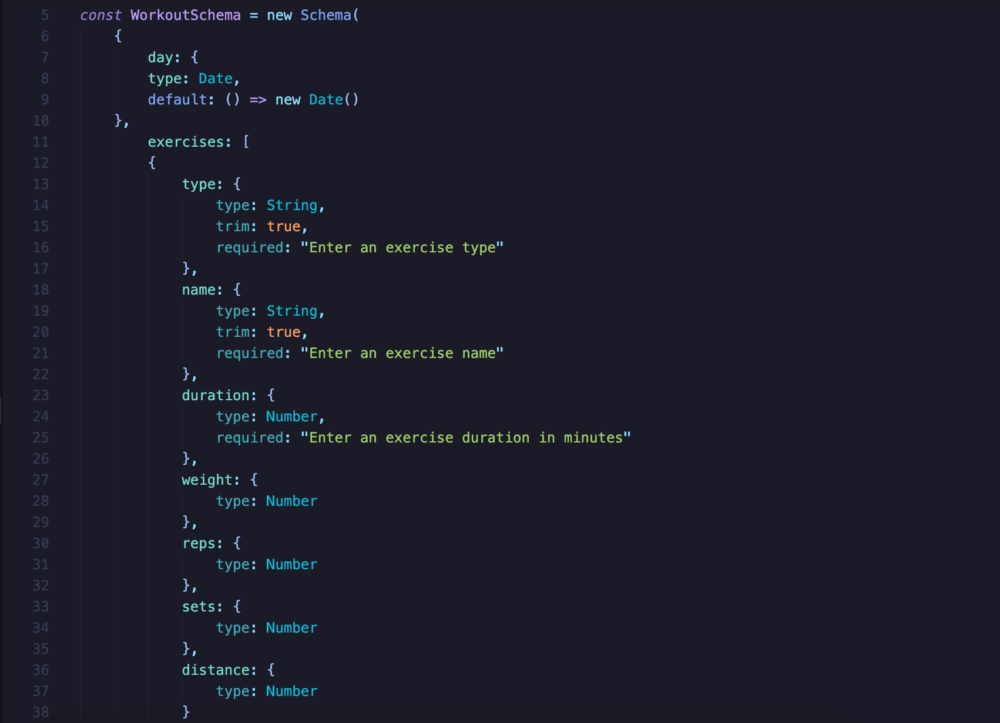
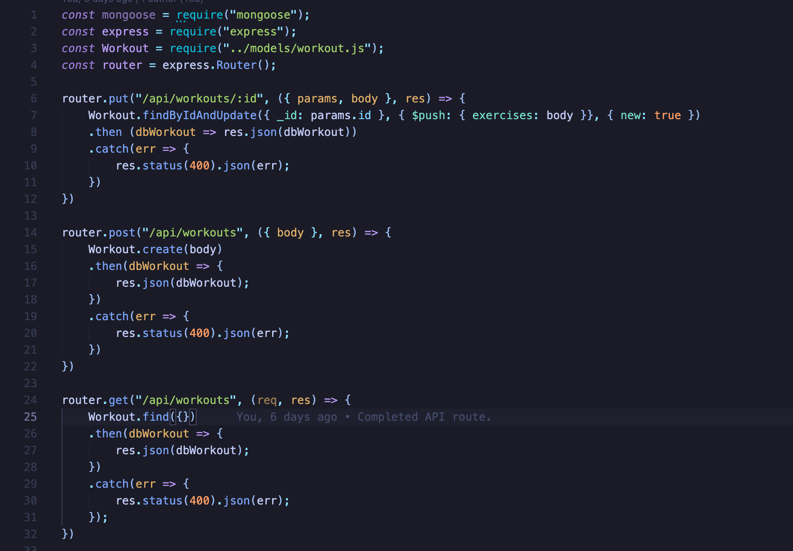
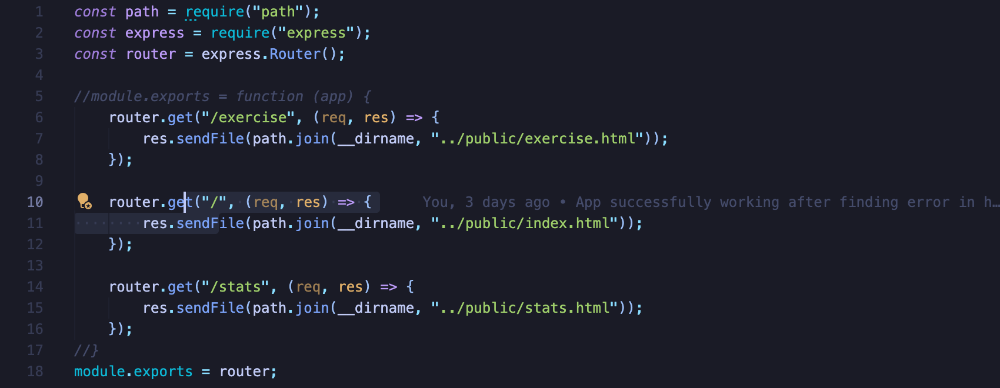
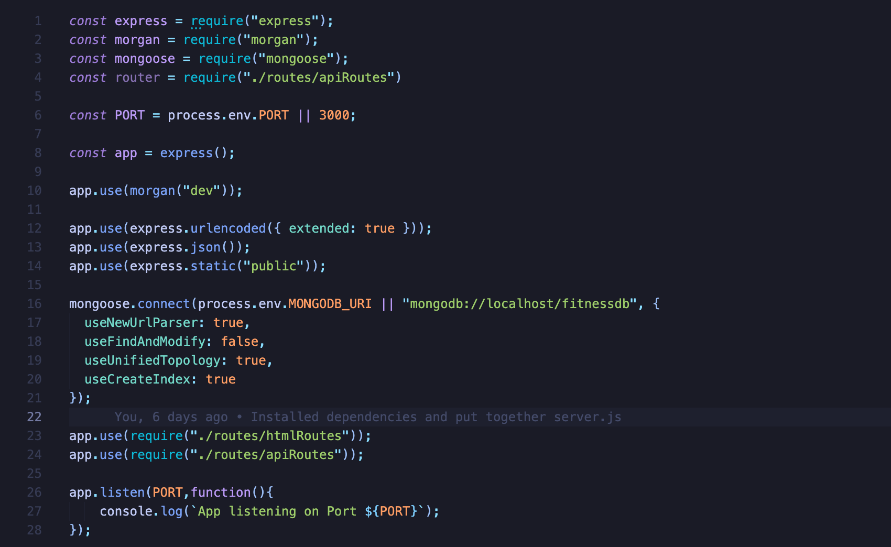

# Fitness-Tracker
This app is a Fitness tracker that allows users to enter in different exercise information and keep a log of their previous workouts. This assignment uses a Mongo database with a Mongoose schema and handles the routes with Express.

## User Story

* As a user, I want to be able to view create and track daily workouts. I want to be able to log multiple exercises in a workout on a given day. I should also be able to track the name, type, weight, sets, reps, and duration of exercise. If the exercise is a cardio exercise, I should be able to track my distance traveled.

## Business Context

A consumer will reach their fitness goals more quickly when they track their workout progress.

## Development

First the model was created to hold the different workout information. The model requires the day/date, and the exercises:

The next step was to create the routes (one of the API's and one for the html) which would handle the different actions the user would take on the site, such as adding a new workout, viewing all workouts, and seeing the appropriate screen after each action. Below shows the general setup of the apiRoutes file:

And the htmlRoutes:

Once both of the routes were taken care of, the server.js file was created in order to allow the app to run with the speicified dependencies:

## Credits

* Express - [EspressJs](https://www.npmjs.com/package/express)

* Mongoose - [Mongoose](https://www.npmjs.com/package/mongoose)

## Links

GitHub Repository - [Tech Blog App Repository](https://github.com/ktrudickm/Fitness-Tracker "Fitness Tracker")

Heroku - [Heroku Fitness Tracker](https://fitness-workouttracker.herokuapp.com/?id=60a6dad535b9010015ee67bc)